# [UNITED EVENTS](https://united-events-a9a097150c85.herokuapp.com)

An events based project for the LGBTQIA+ society which has a pre-populated events; clicking on those events within the calendar pops up a modal offering much more detail, including links to official invidual event websites. There is both a registration form and a login form on the website, allowing users to create and log in to their personal accounts. This enables them to express interest in specific events directly from the calendar modals. There is also a home page, contact page and a team page too!

[](https://github.com/hannahro15/July24Hackathon-United-Events/commits/main)
[](https://github.com/hannahro15/July24Hackathon-United-Events/commits/main)


[](https://github.com/hannahro15/July24Hackathon-United-Events)
[](https://github.com/hannahro15/July24Hackathon-United-Events/commits/main)


## UX

### Colour Scheme

We've used CSS for the colours to simplify switching theme colours quickly (if necessary).

```css
:root {
    --black: 0, 0, 0; /* #000000 */
    --white: 255, 255, 255; /* #FFFFFF */
    --offwhite: 250, 250, 250; /* #FAFAFA */

    --united-red: 255, 0, 0; /* #FF0000 */
    --united-orange: 255, 127, 0; /* #FF7F00 */
    --united-yellow: 255, 255, 0; /* #FFFF00 */
    --united-green: 0, 255, 0; /* #00FF00 */
    --united-blue: 0, 0, 255; /* #0000FF */
    --united-indigo: 75, 0, 130; /* #4B0082 */
    --united-violet: 139, 0, 255; /* #8B00FF */

    --united-grey-light: 125, 125, 125; /* #7D7D7D */
    --united-grey-dark: 58, 58, 58; /* #3A3A3A */

    --united-primary: 241, 26, 123; /* #F11A7B */
    --united-secondary: 152, 33, 118; /* #982176 */
    --united-tertiary: 0, 101, 119;  /* #006577 */
    --united-quaternary: 255, 201, 83; /* #FFC953 */
}
```

We've used [coolors.co](https://coolors.co/f11a7b-982176-006577-ffc953-000000-fafafa) to generate our colour palette.


### Typography
NO MENTION OF MONTSERRAT?

- [Lato](https://fonts.google.com/specimen/Lato) was used for all other secondary text.

- [Font Awesome](https://fontawesome.com) icons were used throughout the site, such as the social media icons in the footer.

## User Stories

### Home Page
- As a user, it should be clear what the website is about and its purpose so I know how to navigate it.
- As a user, the home page should provide a link to the page with the calendar with the events in.

### Registration and Login Form (on two separate pages)

#### New user

- As a new user I should be able to navigate to registration page from the home page
- As a new user, when I visit the application’s homepage, I should be able to see an option to register for a new account.
- As a new user, when on the registration page, I should be able to fill out the form with my name, email, and password.
- As a new user, when I have filled out the registration form I should be able to submit the form easily and the system should validate the form fields such as checking for valid email format and password strength etc.
- When the new user submits the form, the system should create a new user account in the database.
- When a new user's account has been created and is successful, the user should see a confirmation message that their account has been created.
- When the new user's account is successful and see's the confirmation message, they should be automatically logged in to their new account each time they log in.
- As a new user when they create their account the system should send a verification email to their registered email address.
- When a new user has received a verification email, their account should be activated when they click on the link to confirm verification.

#### Registered user

- As a registered user, I should be able to log in to their account so I can view and manage their events.
- As a registered user, when I visit the application’s homepage, I should see an option to log in to my account.
- As a registered user, when I am on the login form and enter my email and password, I should be able to submit the form to log in.
- As a registered user, when they submit the form, the system should validate the email and password fields.
- As a registered user, if the form is valid, the system should check their credentials against the database. If credentials are correct, and when the system authenticates me, then they should be logged in and redirected to their account dashboard.
- As a registered user, if they have entered incorrect credentials and the system fails to authenticate me, then they should see an error message indicating invalid email or password.
- As a registered user, if I forget my password, there should be an option to reset my password by receiving a reset link via email.

By breaking down these user stories into more granular steps, you can ensure that all aspects of the user registration and authentication process are covered and can be implemented systematically.

### Events/Calendar Page

- As a user, I should be able to select events I want and be able to register for them.
- As a user, I should be able to navigate around the events page to find events I need so I can view them.
- As a user, I should be able to scroll through the calendar on the events page and click on each event under each date to register for the event.
- As an admin, they should be able to create, update, add, and remove events from the calendar.

### Contact Us Page

- As a user I should be able to fill out the contact us form and to be able to submit it easily without any issues.

### Team Page

- As a user, I should be able to see details of the team members on the team members page so I see their github profile links, linkedIn urls, and how they contributed to the project.

### General 

- As a user, I expect all the links to be working as expected across the website so I don't come across any broken links.
- As a user, I expect the styling to be consistent across the pages so that I everything looks appealing visually.
- As a user, I expect the website to be responsive on all different screen sizes so I can view all content and information easily.
- As an admin, I should be able to update an Event, so that I can maintain a clean database, clean any mistakes, or remove events no longer needed.
- As an admin, I should be able to delete an Event, so that I can maintain a clean database, clean any mistakes, or remove events no longer needed.

## Wireframes

To follow best practice, wireframes were developed for mobile, tablet, and desktop sizes.
We've used [Balsamiq](https://balsamiq.com/wireframes) to design our site wireframes.

| | Register | Login | Home | Events Calendar |
| --- | --- | --- | --- | --- |
| mobile |  |  |  |  |
| tablet |   |  |  |  |
| desktop |  |  |  |  |


## Features

### Existing Features

- **HOME PAGE**

    - This page introduces us to the website and its purpose. It also states what the whole website is about and its mission.

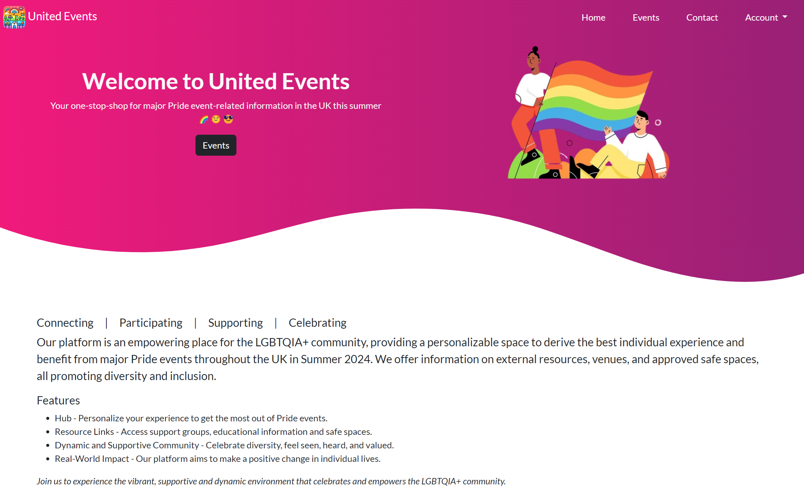

- **EVENTS PAGE**

    - This events page takes the form on the calendar. Users can select events and add it to their profile if they are interested. When clicking on an event there is a pop-up which gives information on the event and a button at the bottom that users can click on to say if they are interested or not and a close button too. 


- **CONTACT PAGE**

    - The contact form for users to submit messages about anything related to LGBTIA+ events on the website or queries in general. The submit button on the page goes directly to the database.


- **ACCOUNT(REGISTER AND LOGIN FORMS) PAGE**

    - There are two separate forms which is withi


- **TEAM PAGE**
    
    - The team page is a page that features members of the team who worked on the project in a form of a grid layout. Each team member card shows their photo, GitHub and LinkedIn URL's and outlines their individual contributions to the group project.


- **NAVBAR**
  
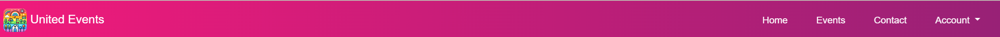

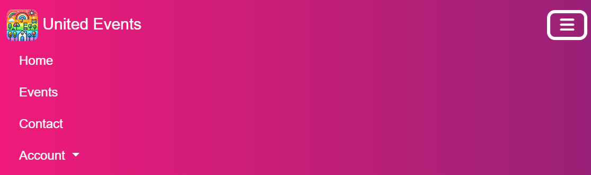


- **FOOTER**


- **USER PROFILE PAGE**

- This page is where a user can add or remove events to their profile.

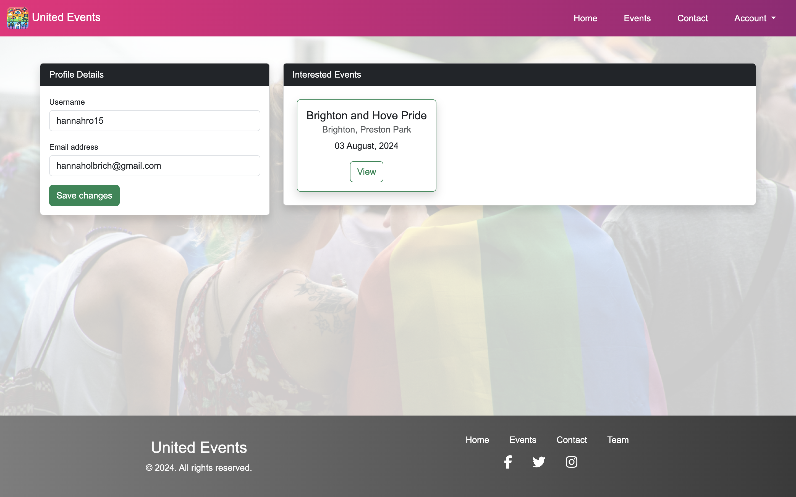

- **EVENTS ADMIN PAGE**

- This is where the admins can add, update or delete events, to keep the calendar 'current' & relevant.

    - Manage Events
    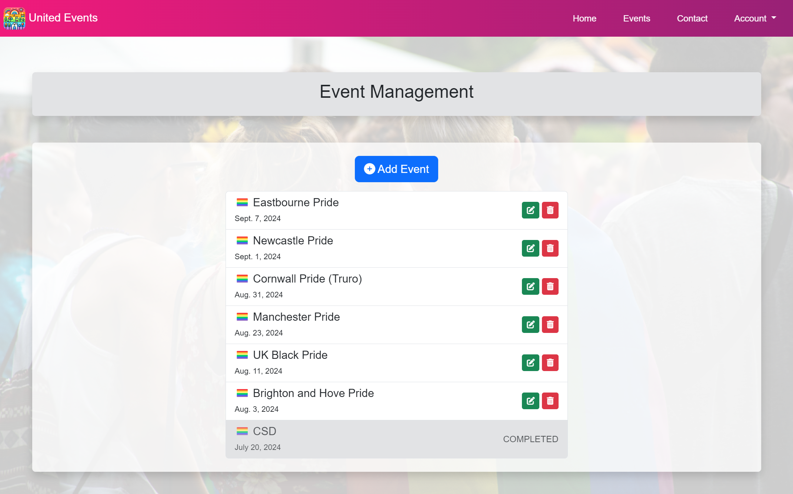

    - Add Event
    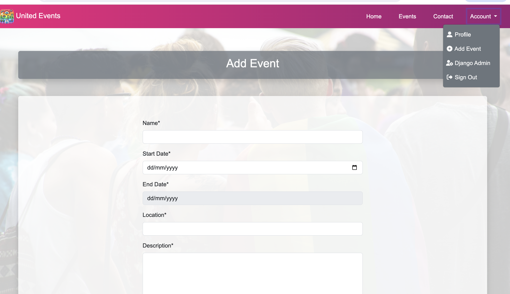

    - Edit Event
    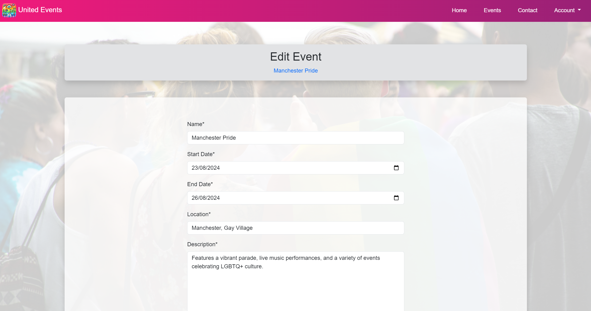

    - Delete Event
    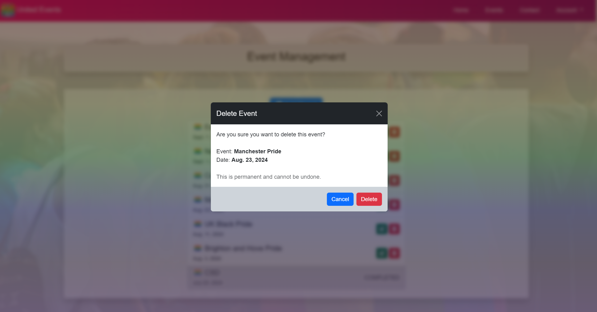


- **ERROR PAGES**

    - We have included error handling for the following pages:

    | error | screenshot |
    | ---- | --- |
    | 400 |  |
    | 403 |  |
    | 404 |  |
    | 500 |  |

### Future Features

- Add in a functionality on the events page so that users can filter events by location or by type of event.
    - This can ensure that users can select and filter what events they are interested or not interested in based on their own requirements.
- Add more styling to the register and login page 
   
## Tools & Technologies Used

- [](https://git-scm.com) used for version control. (`git add`, `git commit`, `git push`)
- [](https://github.com) used for secure online code storage.
- [](https://gitpod.io) used as a cloud-based IDE for development.
- [](https://code.visualstudio.com) used as a local IDE for development.
- [](https://en.wikipedia.org/wiki/HTML) used for the main site content.
- [](https://en.wikipedia.org/wiki/CSS) used for the main site design and layout.
- [](https://www.javascript.com) used for user interaction on the site.
- [](https://jquery.com) used for user interaction on the site.
- [](https://www.python.org) used as the back-end programming language.
- [](https://www.heroku.com) used for hosting the deployed back-end site.
- [](https://getbootstrap.com) used as the front-end CSS framework for modern responsiveness and pre-built components.
- [](https://www.djangoproject.com) used as the Python framework for the site.
- [](https://www.postgresql.org) used as the relational database management.
- [](https://dbs.ci-dbs.net) used as the Postgres database from Code Institute.
- [](https://whitenoise.readthedocs.io) used for serving static files with Heroku.
- [](https://balsamiq.com/wireframes) used for creating wireframes.
- [](https://fontawesome.com) used for the icons.
- [](https://chat.openai.com) used to help debug, troubleshoot, and explain things.

## Testing

### Code Validation

#### HTML

We have used the recommended [HTML W3C Validator](https://validator.w3.org) to validate our HTML files.

| Page | W3C URL | Screenshot | Notes |
| --- | --- | --- | --- |
| index | [W3C](https://validator.w3.org/nu/?doc=https://united-events-a9a097150c85.herokuapp.com/) | 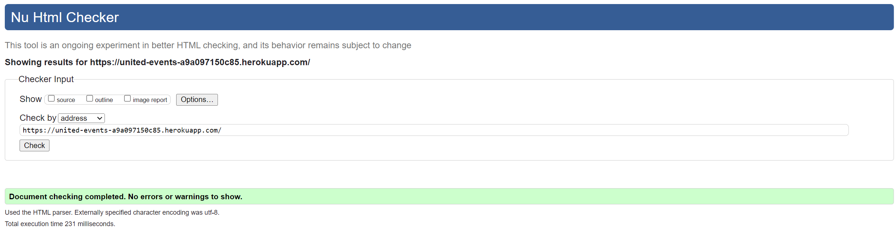 | Fixed "section lacks heading" warning |
| events | [W3C](https://validator.w3.org/nu/?doc=https://united-events-a9a097150c85.herokuapp.com/events/) | 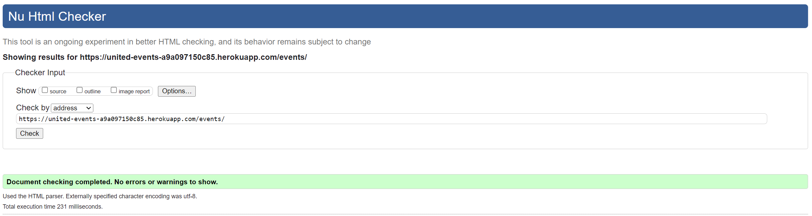 | Fixed "section lacks heading" warning |
| contact | [W3C](https://validator.w3.org/nu/?doc=https://united-events-a9a097150c85.herokuapp.com/contact/) | 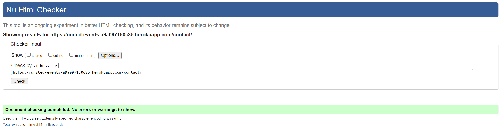 | ✅ |
| team | [W3C](https://validator.w3.org/nu/?doc=https://united-events-a9a097150c85.herokuapp.com/team/) | 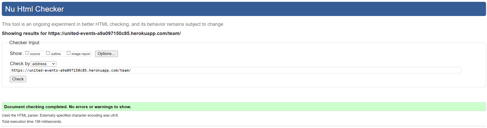 | ✅ |
| profile | N/A | 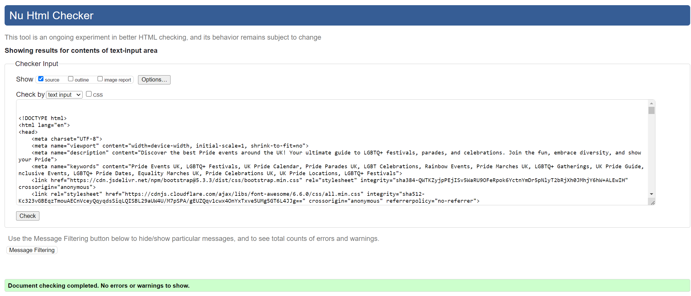 | Fixed invalid spaces in href error |
| event management | N/A | 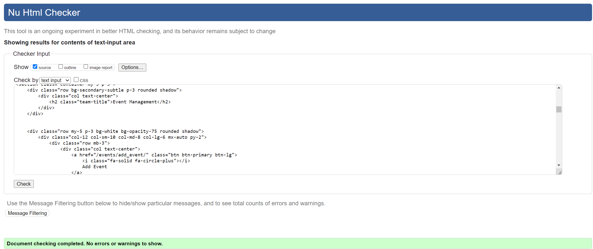 | Fixed duplicate ID errors |
| add event | N/A | 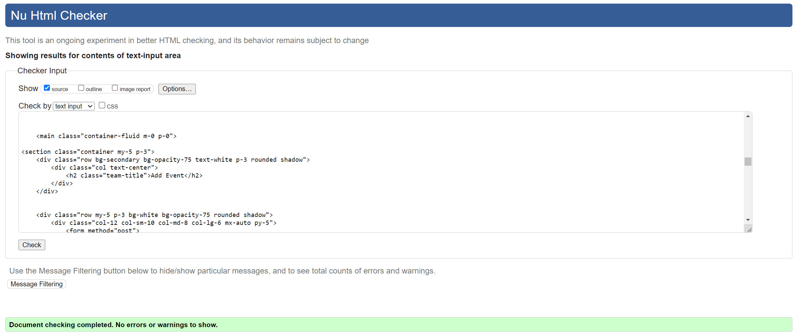 | ✅ |
| edit event | N/A | 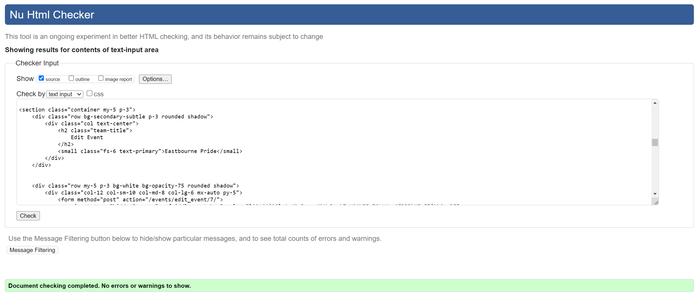 | ✅ |

#### CSS

We have used the recommended [CSS Jigsaw Validator](https://jigsaw.w3.org/css-validator) to validate our CSS files.

| File | Jigsaw URL | Screenshot | Notes |
| --- | --- | --- | --- |
| styles.css | [Jigsaw](https://jigsaw.w3.org/css-validator/validator?uri=https%3A%2F%2Funited-events-a9a097150c85.herokuapp.com) | 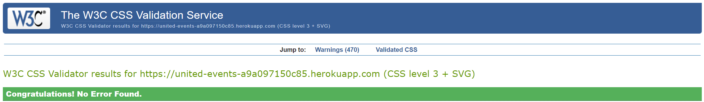 | ✅ |
| events.css | N/A | 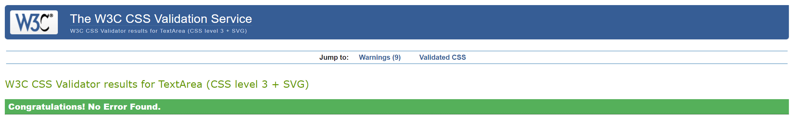 | ✅ |
| team.css | N/A | 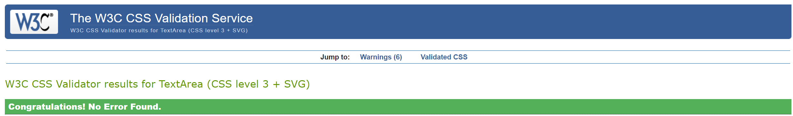 | ✅ |

#### JAVASCRIPT

We have used the recommended [JShint Validator](https://jshint.com) to validate our JS file.

| File | Screenshot | Notes |
| --- | --- | --- |
| scripts.js | 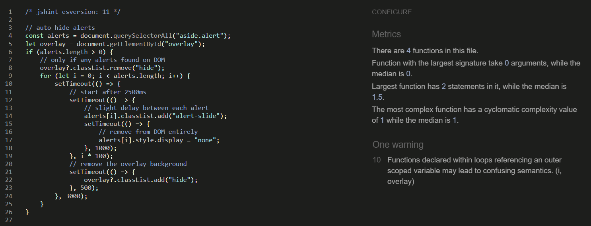 | Warning: outer-scoped functions |

#### PYTHON

We have used the recommended [PEP8 CI Python Linter](https://pep8ci.herokuapp.com) to validate our Python files.

| File | CI URL | Screenshot | Notes |
| --- | --- | --- | --- |
| contact/admin.py | [PEP8 CI](https://raw.githubusercontent.com/hannahro15/July24Hackathon-United-Events/main/contact/admin.py) | 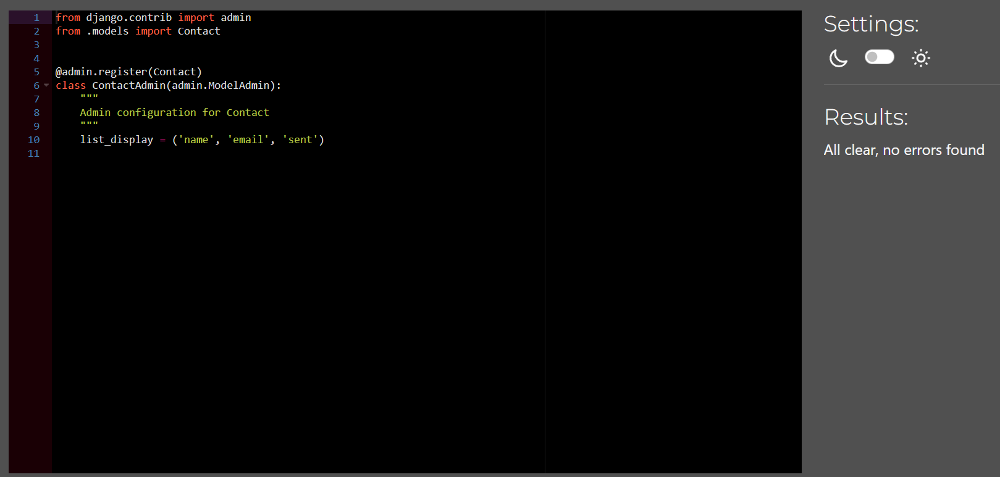 | ✅ |
| contact/forms.py | [PEP8 CI](https://pep8ci.herokuapp.com/https://raw.githubusercontent.com/hannahro15/July24Hackathon-United-Events/main/contact/forms.py) | 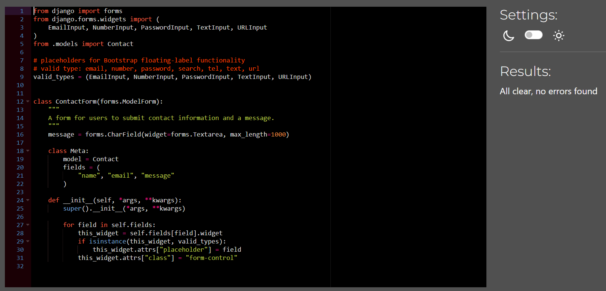 | ✅ |
| contact/models.py | [PEP8 CI](https://pep8ci.herokuapp.com/https://raw.githubusercontent.com/hannahro15/July24Hackathon-United-Events/main/contact/models.py) | 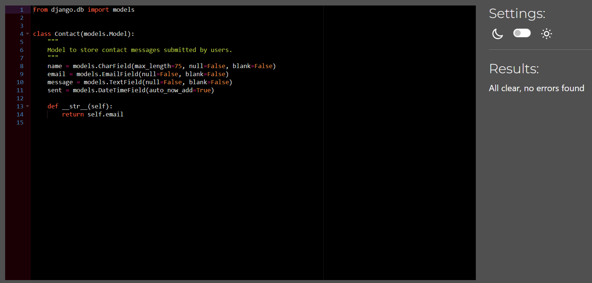 | ✅ |
| contact/urls.py | [PEP8 CI](https://pep8ci.herokuapp.com/https://raw.githubusercontent.com/hannahro15/July24Hackathon-United-Events/main/contact/urls.py) | 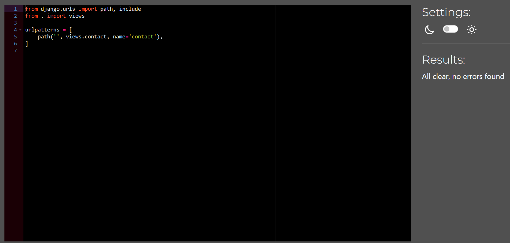 | ✅ |
| contact/views.py | [PEP8 CI](https://pep8ci.herokuapp.com/https://raw.githubusercontent.com/hannahro15/July24Hackathon-United-Events/main/contact/views.py) |  | ✅ |
| events/admin.py | [PEP8 CI](https://pep8ci.herokuapp.com/https://raw.githubusercontent.com/hannahro15/July24Hackathon-United-Events/main/events/admin.py) | 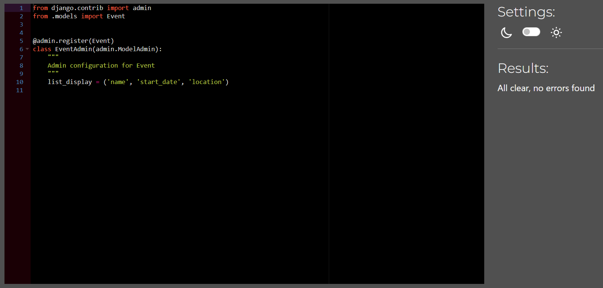 | ✅ |
| events/forms.py | [PEP8 CI](https://pep8ci.herokuapp.com/https://raw.githubusercontent.com/hannahro15/July24Hackathon-United-Events/main/events/forms.py) | 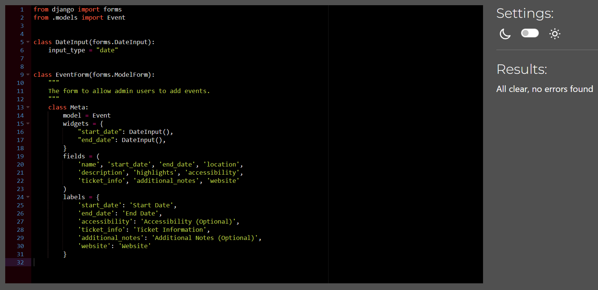 | ✅ |
| events/models.py | [PEP8 CI](https://pep8ci.herokuapp.com/https://raw.githubusercontent.com/hannahro15/July24Hackathon-United-Events/main/events/models.py) | 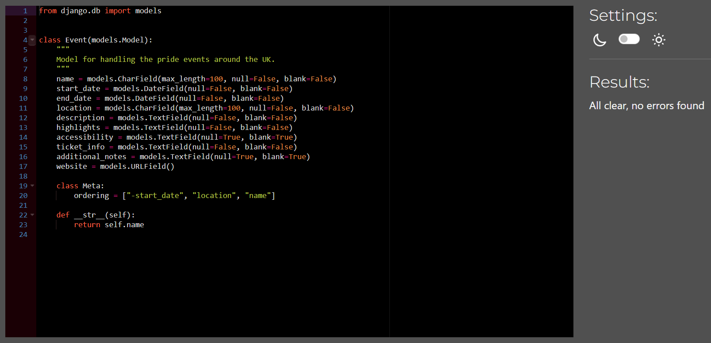 | ✅ |
| events/urls.py | [PEP8 CI](https://pep8ci.herokuapp.com/https://raw.githubusercontent.com/hannahro15/July24Hackathon-United-Events/main/events/urls.py) | 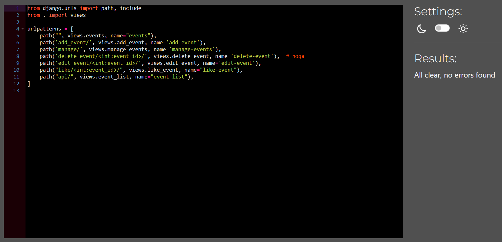 | ✅ |
| events/views.py | [PEP8 CI](https://pep8ci.herokuapp.com/https://raw.githubusercontent.com/hannahro15/July24Hackathon-United-Events/main/events/views.py) | 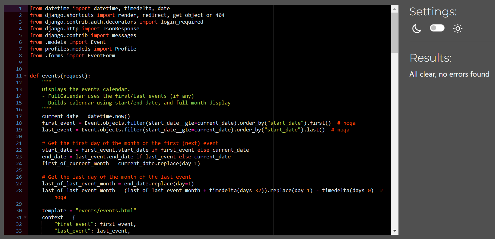 | ✅ |
| index/urls.py | [PEP8 CI](https://pep8ci.herokuapp.com/https://raw.githubusercontent.com/hannahro15/July24Hackathon-United-Events/main/index/urls.py) | 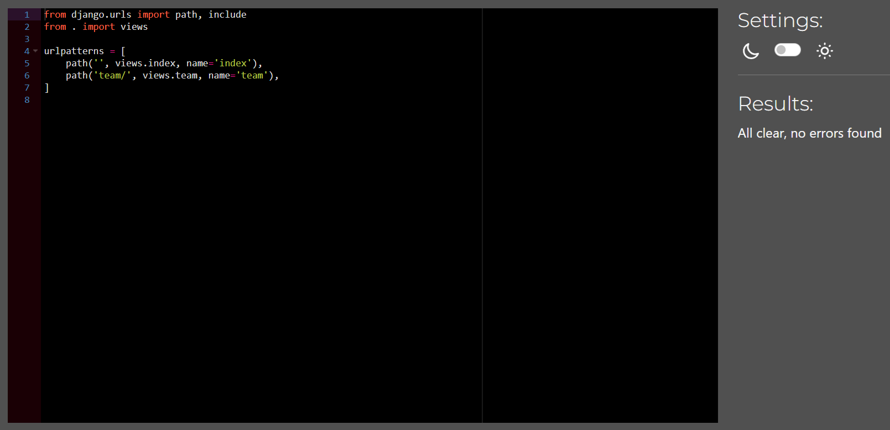 | ✅ |
| index/views.py | [PEP8 CI](https://pep8ci.herokuapp.com/https://raw.githubusercontent.com/hannahro15/July24Hackathon-United-Events/main/index/views.py) | 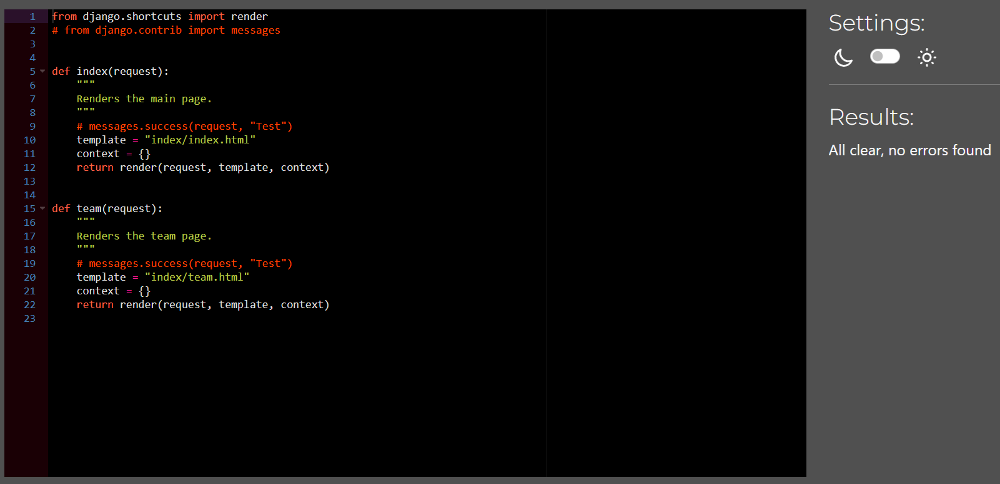 | ✅ |
| profiles/admin.py | [PEP8 CI](https://pep8ci.herokuapp.com/https://raw.githubusercontent.com/hannahro15/July24Hackathon-United-Events/main/profiles/admin.py) | 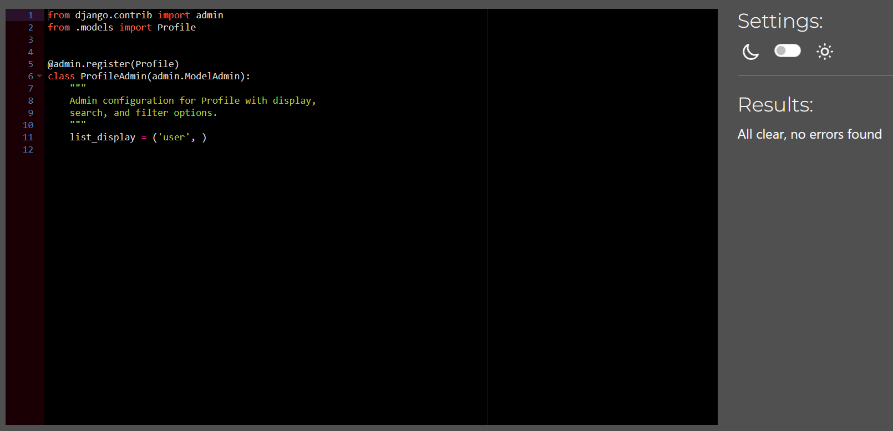 | ✅ |
| profiles/models.py | [PEP8 CI](https://pep8ci.herokuapp.com/https://raw.githubusercontent.com/hannahro15/July24Hackathon-United-Events/main/profiles/models.py) | 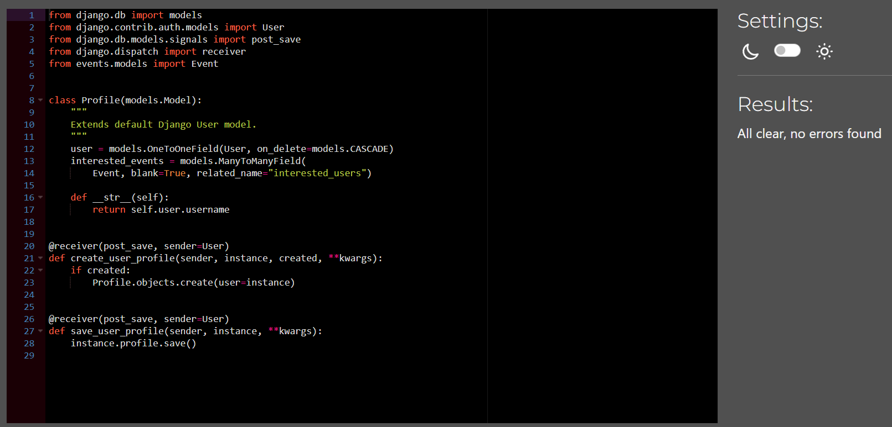 | ✅ |
| profiles/urls.py | [PEP8 CI](https://pep8ci.herokuapp.com/https://raw.githubusercontent.com/hannahro15/July24Hackathon-United-Events/main/profiles/urls.py) | 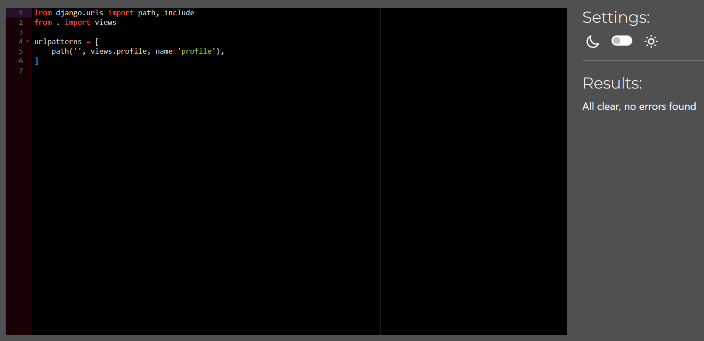 | ✅ |
| profiles/views.py | [PEP8 CI](https://pep8ci.herokuapp.com/https://raw.githubusercontent.com/hannahro15/July24Hackathon-United-Events/main/profiles/views.py) | 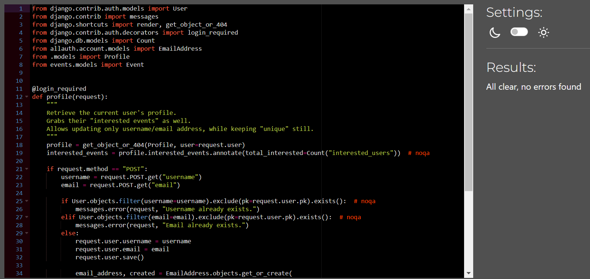 | ✅ |
| united/settings.py | [PEP8 CI](https://pep8ci.herokuapp.com/https://raw.githubusercontent.com/hannahro15/July24Hackathon-United-Events/main/united/settings.py) |  | ✅ |
| united/urls.py | [PEP8 CI](https://pep8ci.herokuapp.com/https://raw.githubusercontent.com/hannahro15/July24Hackathon-United-Events/main/united/urls.py) | 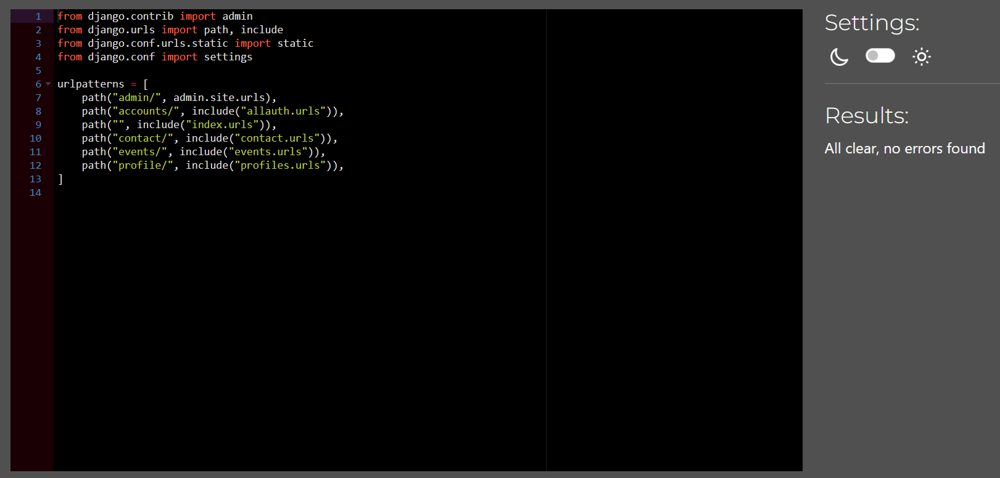 | ✅ |
| united/views.py | [PEP8 CI](https://pep8ci.herokuapp.com/https://raw.githubusercontent.com/hannahro15/July24Hackathon-United-Events/main/united/views.py) | 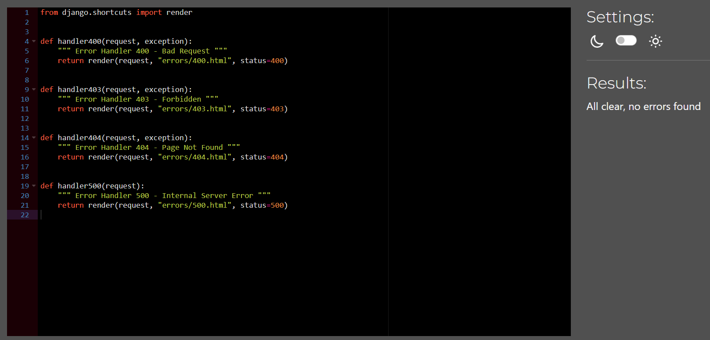 | ✅ |

### Unfixed bugs

- ~~Django security issue with vulnerabilities~~
    - PATCHED: updated `Django==4.2.14`

 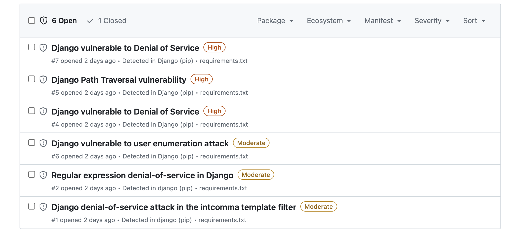

## Database Design

Entity Relationship Diagrams (ERD) help to visualize database architecture before creating models.
Understanding the relationships between different tables can save time later in the project.

Below is our ERD using the [Mermaid](https://mermaid.live/edit#pako:eNqdU8tuwjAQ_BXLZzjQY24VDVJFeQhoT5EiEy9hRWJH9kYUkfx77YaW1oCoaimSMzMez242R55pCTziYJ5Q5EaUiWJuDWfT1eNwxY7dq1-oiKFk8_EZsmRQ5UyJEi5AKAUWZ5TgnVgJ1or8h1YKAsISmAVFHdwmqtvEb_H0XwG8qWOEodRvAwKUDOCTSaEzQahVkFmCzQxWV5gt5tvCPWQDQmSZKxTXWCAdAo4w2wGlqDY6PCUl-ltEkSpNYC8C7mFt8Sv4d5vmi9no-SW-0ygP1RZM6vDROLB4XcaLvzXaW1z92pWwdq-NvDcGa60Lhja1dQXGu92opmn6_abpkkUs4YNokPDfkraTdGPiNZOHidfwHi_BuGulG-vPqhJOW3ChuVdJYXZe1jqdqEkvDyrjEZkaeryu_GScfgQebURhof0A3PfwUg) library.

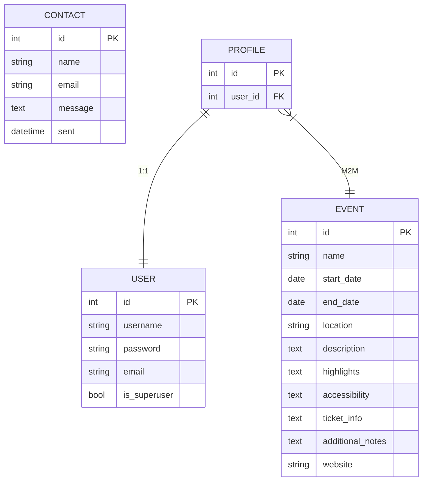
```mermaid
erDiagram
    CONTACT {
        int id PK
        string name
        string email
        text message
        datetime sent
    }

    EVENT {
        int id PK
        string name
        date start_date
        date end_date
        string location
        text description
        text highlights
        text accessibility
        text ticket_info
        text additional_notes
        string website
    }

    PROFILE {
        int id PK
        int user_id FK
    }

    USER {
        int id PK
        string username
        string password
        string email
        bool is_superuser
    }

    PROFILE ||--|| USER : "1:1"
    PROFILE }|--|| EVENT : "M2M"
```


## Agile Development Process

### GitHub Projects

[GitHub Projects](https://github.com/users/hannahro15/projects/3) served as an Agile tool for this project.
It isn't a specialized tool, but with the right tags and project creation/issue assignments, it can be made to work.

Through it, user stories, issues & tasks were planned and then tracked on a daily basis using the basic Kanban board.

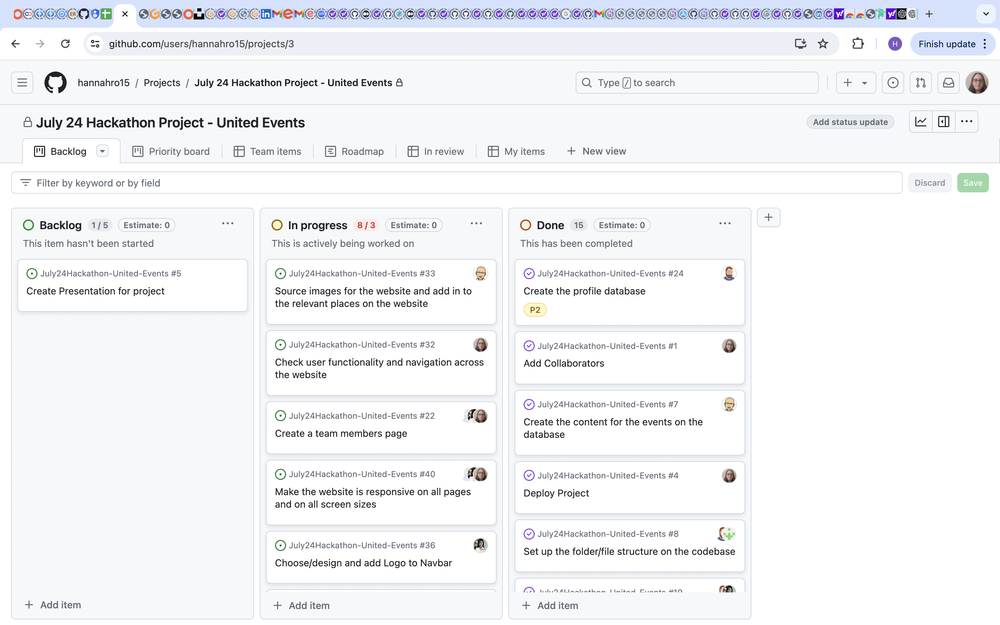

### GitHub Issues

[GitHub Issues](https://github.com/hannahro15/July24Hackathon-United-Events/issues) served as an another Agile tool.

It also helped with iterations on a daily basis.


- [Open Issues](https://github.com/hannahro15/July24Hackathon-United-Events/issues) [](https://github.com/hannahro15/July24Hackathon-United-Events/issues)

    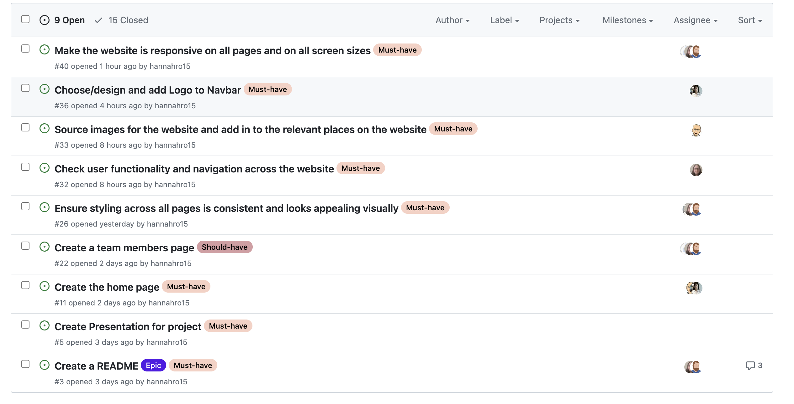

- [Closed Issues](https://github.com/hannahro15/July24Hackathon-United-Events/issues?q=is%3Aissue+is%3Aclosed) [](https://github.com/hannahro15/July24Hackathon-United-Events/issues?q=is%3Aissue+is%3Aclosed)

    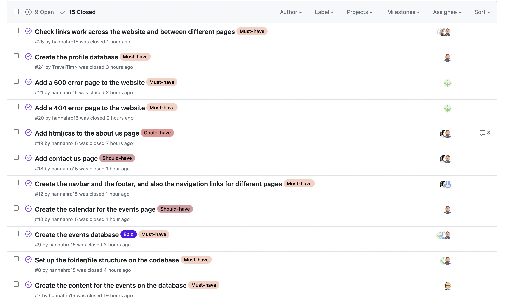
    

### MoSCoW Prioritization

We've decomposed our Epics into stories prior to prioritizing and implementing them.
Using this approach, we were able to apply the MoSCow prioritization and labels to our user stories within the Issues tab.

- **Must Have**: guaranteed to be delivered (*max 60% of stories*)
- **Should Have**: adds significant value, but not vital (*the rest ~20% of stories*)
- **Could Have**: has small impact if left out (*20% of stories*)
- **Won't Have**: not a priority for this iteration

## Deployment

The live deployed application can be found deployed on [Heroku](https://united-events-a9a097150c85.herokuapp.com).

### PostgreSQL Database

This project uses a [Code Institute PostgreSQL Database](https://dbs.ci-dbs.net).

To obtain our own Postgres Database from Code Institute, we followed these steps:

- Signed-in to the CI LMS using one of our team member's email address.
- An email was sent to them with our new Postgres Database.

> [!CAUTION]  
> - PostgreSQL databases by Code Institute are only available to CI Students.
> - You must acquire your own PostgreSQL database through some other method
> if you plan to clone/fork this repository.
> - Code Institute students are allowed a maximum of 8 databases.
> - Databases are subject to deletion after 18 months.

### Heroku Deployment

This project uses [Heroku](https://www.heroku.com), a platform as a service (PaaS) that enables developers to build, run, and operate applications entirely in the cloud.

Deployment steps are as follows, after account setup:

- Select **New** in the top-right corner of your Heroku Dashboard, and select **Create new app** from the dropdown menu.
- Your app name must be unique, and then choose a region closest to you (EU or USA), and finally, select **Create App**.
- From the new app **Settings**, click **Reveal Config Vars**, and set your environment variables.

> [!IMPORTANT]  
> This is a sample only; you would replace the values with your own if cloning/forking our repository.

| Key | Value |
| --- | --- |
| `DATABASE_URL` | user's own value |
| `SECRET_KEY` | user's own value |

Heroku needs two additional files in order to deploy properly.

- requirements.txt
- Procfile

You can install this project's **requirements** (where applicable) using:

- `pip3 install -r requirements.txt`

If you have your own packages that have been installed, then the requirements file needs updated using:

- `pip3 freeze --local > requirements.txt`

The **Procfile** can be created with the following command:

- `echo web: gunicorn app_name.wsgi > Procfile`
- *replace **app_name** with the name of your primary Django app name; the folder where settings.py is located*

For Heroku deployment, follow these steps to connect your own GitHub repository to the newly created app:

Either:

- Select **Automatic Deployment** from the Heroku app.

Or:

- In the Terminal/CLI, connect to Heroku using this command: `heroku login -i`
- Set the remote for Heroku: `heroku git:remote -a app_name` (replace *app_name* with your app name)
- After performing the standard Git `add`, `commit`, and `push` to GitHub, you can now type:
	- `git push heroku main`

The project should now be connected and deployed to Heroku!

### Local Deployment

This project can be cloned or forked in order to make a local copy on your own system.

For either method, you will need to install any applicable packages found within the *requirements.txt* file.

- `pip3 install -r requirements.txt`.

You will need to create a new file called `env.py` at the root-level,
and include the same environment variables listed above from the Heroku deployment steps.

> [!IMPORTANT]  
> This is a sample only; you would replace the values with your own if cloning/forking our repository.

Sample `env.py` file:

```python
import os

os.environ.setdefault("DATABASE_URL", "user's own value")
os.environ.setdefault("SECRET_KEY", "user's own value")

# local environment only (do not include these in production/deployment!)
os.environ.setdefault("DEBUG", "True")
```

Once the project is cloned or forked, in order to run it locally, you'll need to follow these steps:

- Start the Django app: `python3 manage.py runserver`
- Stop the app once it's loaded: `CTRL+C` or `⌘+C` (Mac)
- Make any necessary migrations: `python3 manage.py makemigrations`
- Migrate the data to the database: `python3 manage.py migrate`
- Create a superuser: `python3 manage.py createsuperuser`
- Load fixtures (if applicable): `python3 manage.py loaddata file-name.json` (repeat for each file)
- Everything should be ready now, so run the Django app again: `python3 manage.py runserver`

#### Cloning

You can clone the repository by following these steps:

1. Go to the [GitHub repository](https://github.com/hannahro15/July24Hackathon-United-Events) 
2. Locate the Code button above the list of files and click it 
3. Select if you prefer to clone using HTTPS, SSH, or GitHub CLI and click the copy button to copy the URL to your clipboard
4. Open Git Bash or Terminal
5. Change the current working directory to the one where you want the cloned directory
6. In your IDE Terminal, type the following command to clone our repository:
	- `git clone https://github.com/hannahro15/July24Hackathon-United-Events.git`
7. Press Enter to create your local clone.

Alternatively, if using Gitpod, you can click below to create your own workspace using this repository.

[](https://gitpod.io/#https://github.com/hannahro15/July24Hackathon-United-Events)

Please note that in order to directly open the project in Gitpod, you need to have the browser extension installed.
A tutorial on how to do that can be found [here](https://www.gitpod.io/docs/configure/user-settings/browser-extension).

#### Forking

By forking the GitHub Repository, we make a copy of the original repository on our GitHub account to view and/or make changes without affecting the original owner's repository.
You can fork this repository by using the following steps:

1. Log in to GitHub and locate the [GitHub Repository](https://github.com/hannahro15/July24Hackathon-United-Events)
2. At the top of the Repository (not top of page) just above the "Settings" Button on the menu, locate the "Fork" Button.
3. Once clicked, you should now have a copy of the original repository in your own GitHub account!

### Local VS Deployment

There are no major differences between the local version and the deployed version.

## Credits

### Content

| Source | Location | Notes |
| --- | --- | --- |
| [Chris Beams](https://chris.beams.io/posts/git-commit) | version control | "How to Write a Git Commit Message" |
| [WhiteNoise](http://whitenoise.evans.io) | entire site | hosting static files on Heroku temporarily |
| [FullCalendar](https://www.jsdelivr.com/package/npm/fullcalendar) | Events page | Calendar widget |

### Media

| Source | Location | Notes |
| --- | --- | --- |
| [ChatGPT](https://chat.openai.com) | navbar logo | Generated by DALLE-3 |
| [ChatGPT](https://chat.openai.com) | favicon | Generated by DALLE-3 |
| [Freepik](https://img.freepik.com/free-vector/pride-day-flag-with-rainbow-colors_52683-13487.jpg) | hero image |
| [ADHD-360](https://www.adhd-360.com/wp-content/uploads/2024/02/Contact-us.webp) | contact | contact form |
| [Checkpoint-Queer](https://checkpoint-queer.de/wp-content/uploads/2021/02/pexels-brett-sayles-1167034-1024x683.jpg) | background | all pages |

### Acknowledgements

A huge shout out to our fellow team members:
- Gary Sorohan: [GitHub](https://github.com/Soro82)
- Hannah Olbrich: [GitHub](https://github.com/hannahro15)
- Lauren Yeung: [GitHub](https://github.com/Lauren21717)
- Sean Lutz: [GitHub](https://github.com/primarypigments)
- Tim Nelson: [GitHub](https://github.com/TravelTimN)
- Trevor Leslie: [GitHub](https://github.com/TrevorJamesLeslie)

And of course our lovely facilitators:
- Sawyer, Kenan, Rachel, and Maria
