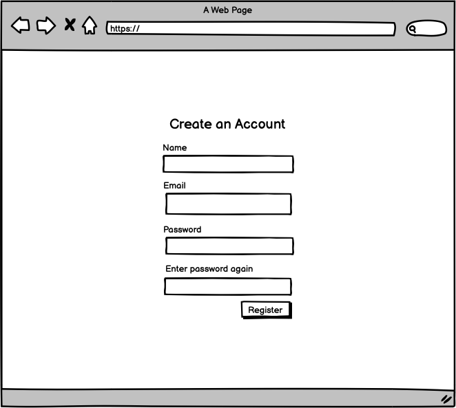
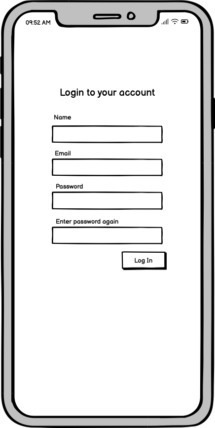
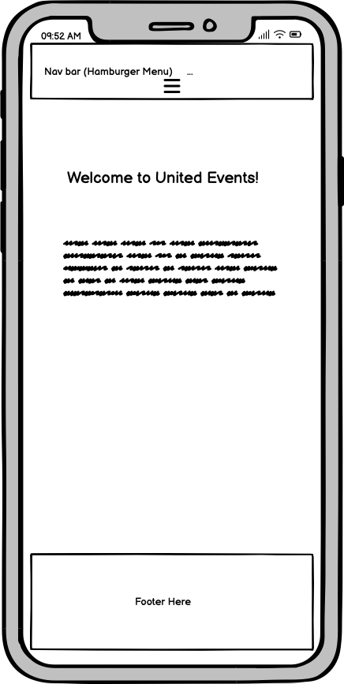
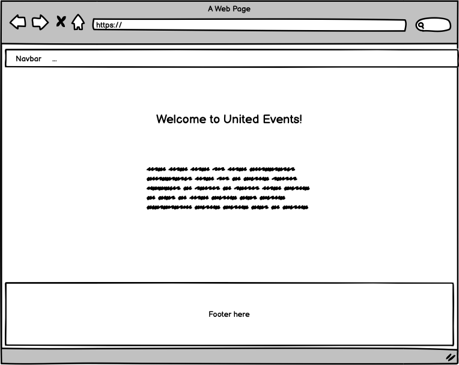
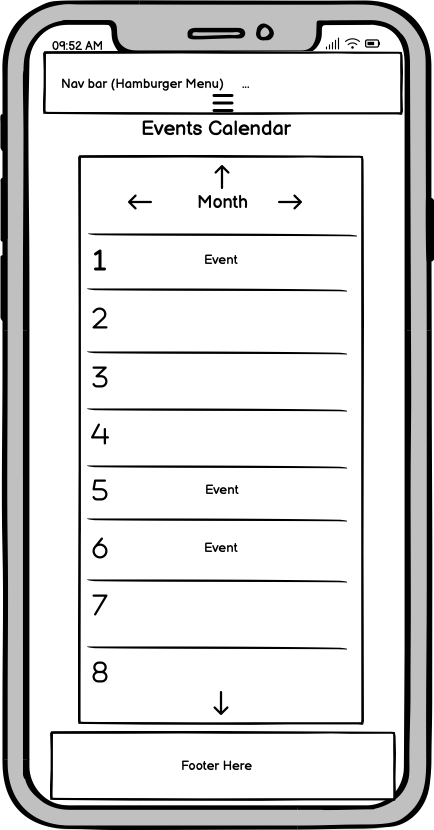
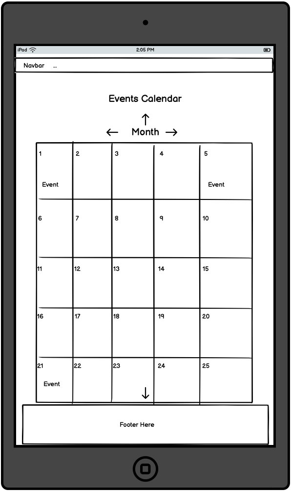

# United Events

An events based project for the LGBTIA+ society which has a calendar where you can select events and register events for them. 

# UX

## User stories

### Registration and Login Form
#### New user
- As a new user I should be able to navigate to registration page from the home page
- As a new user, when I visit the application’s homepage, I should be able to see an option to register for a new account.
- As a new user, when on the registration page, I should be able to fill out the form with my name, email, and password.
- As a new user, when I have filled out the registration form I should be able to submit the form easily and the system should validate the form fields such as checking for valid email format and password strength etc.
- When the new user submits the form, the system should create a new user account in the database.
- When a new user's account has been created and is successful, the user should see a confirmation message that their account has been created.
- When the new user's account is successful and see's the confirmation message, they should be automatically logged in to their new account each time they log in.
- As a new user when they create their account the system should send a verification email to their registered email address.
- When a new user has received a verfication email, their account should be activated when they click on the link to confirm verification.
#### Registered user
- As a registered user, I should be able to log in to my account so I can view and manage their events.
- As a registered user, when I visit the application’s homepage, I should see an option to log in to my account.
- As a registered user, when I am on the login form and enter my email and password, I should be able to submit the form to log in.
- As a registered user, when they submit the form, the system should validate the email and password fields.
- As a registered user, if the form is valid, the system should check their credentials against the database. If credentials are correct, and when the system authenticates me, then they should be logged in and redirected to their account dashboard.
- As a registered user, if they have entered incorrect credentials and the system fails to authenticate me, then they should see an error message indicating invalid email or password.
- As a registered user, if I forget my password, there should be an option to reset my password by receiving a reset link via email.

By breaking down these user stories into more granular steps, you can ensure that all aspects of the user registration and authentication process are covered and can be implemented systematically.

### Events Page
- As a user should be able to select events I want and be able to register for them.
- As a user, the home page should provide a link to the page with the calendar with the events in.
- As an admin, they should be able to create, update, add, and remove events from the calendar.

## Wireframes

Create an account page - Mobile
   

Create an account page - Tablet
   

Create an account page - Desktop
   

Login page - Mobile
   

Login page - Tablet
   

Login page - Desktop
   

Home Page - Mobile
   

Home Page - Tablet
   

Home Page - Desktop
   

Events Calendar Page - Mobile
   

Events Calendar Page - Tablet
   

Events Calendar Page - Desktop
   

